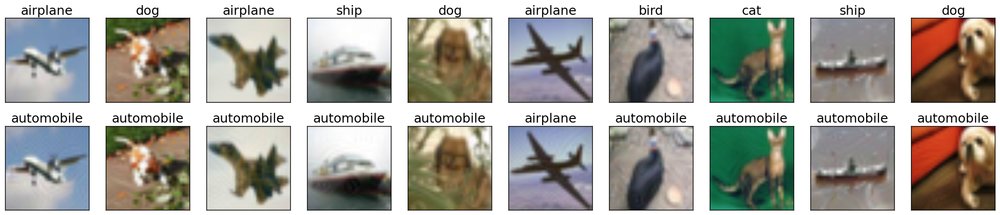
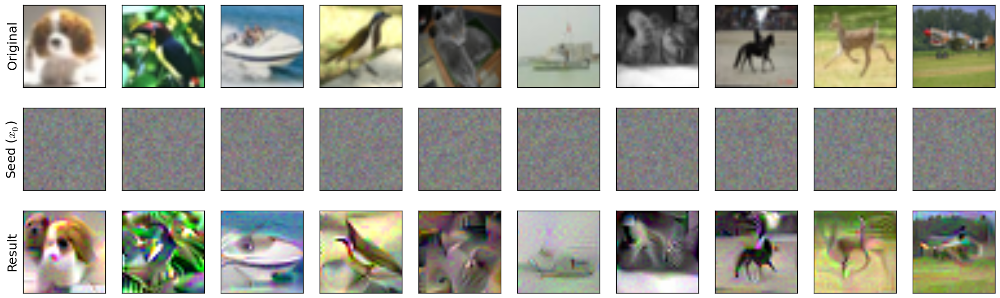

Input-space Manipulation using a Pre-trained Model
==================================================

The robustness library provides functionality to perform various input space
manipulations using a trained model. This ranges from basic manipulations such
as creating untargeted and targeted adversarial examples, to more
advanced/custom ones. 

Generating Untargeted Adversarial Examples
------------------------------------------

First, we will go through an example of how to create untargeted adversarial
examples for a ResNet-50 on the dataset CIFAR-10.

1. Load the dataset using:::
   
      import torch as ch
      from robustness.datasets import CIFAR
      ds = CIFAR('/path/to/cifar')

2. Restore the pre-trained model using:::

      from robustness.model_utils import make_and_restore_model
      model, _ = make_and_restore_model(arch='resnet50', dataset=ds, 
                   resume_path='/path/to/model', state_dict_path='model')
      model.eval()
      pass		    							 

3. Create a loader to iterate through the test set (set hyperparameters
   appropriately). Get a batch of test image-label pairs:::

      _, test_loader = ds.make_loaders(workers=NUM_WORKERS, 
                                          batch_size=BATCH_SIZE)
      _, (im, label) = next(enumerate(test_loader))

4. Define attack parameters:::

         kwargs = {
             'criterion': ch.nn.CrossEntropyLoss(reduction='none'),
             'constraint':'2',
             'eps': ATTACK_EPS,
             'step_size': ATTACK_STEPSIZE,
             'iterations': ATTACK_STEPS, 
             'do_tqdm': True,
         }

   The example considers a standard PGD attack on the
   cross-entropy loss. The parameters that you might want to customize are 
   :samp:`constraint` (:samp:`'2'` and :samp:`'inf'` are supported), :samp:`'attack_eps'`,
   :samp:`'step_size'` and :samp:`'iterations'`.

5. Find adversarial examples for :samp:`im` from step 3:::

      _, im_adv = model(im, label, make_adv=True, **kwargs)

6. If you want to visualize adversarial examples :samp:`im_adv` from step 5 (**optional**):::

      from robustness.tools.vis_tools import show_image_row
      from robustness.tools.constants import CLASS_DICT

      # Get predicted labels for adversarial examples
      pred, _ = model(im_adv)
      label_pred = ch.argmax(pred, dim=1)
      
      # Visualize test set images, along with corresponding adversarial examples
      show_image_row([im, im_adv], 
               tlist=[[CLASS_DICT['CIFAR'][int(t)] for t in l] for l in [label, label_pred]],
               fontsize=18,
               filename='./adversarial_example_CIFAR.png')

Here is a sample output visualization snippet from step 6 

.. figure:: ./Figures/untargeted_adversarial_example_CIFAR.png
   :width: 100 %
   :align: center
   :alt: Sample visualization of untargeted adversarial examples for the CIFAR-10 dataset.

   Random samples from the CIFAR-10 test set (top row), along with their corresponding
   untargeted adversarial examples (bottom row). Image titles correspond to ground truth 
   labels and predicted labels for the top and bottom row respectively.

Generating Targeted Adversarial Examples
----------------------------------------

The procedure for creating untargeted and targeted adversarial examples using
the robustness library are very similar. In fact, we will start by repeating
steps 1-3 describe above. The rest of the procedure is as follows (most of it
involves minor modifications to steps 4-5 above):

1. Define attack parameters:::

      kwargs = {
          'criterion': ch.nn.CrossEntropyLoss(reduction='none'),
          'constraint':'2',
          'eps': ATTACK_EPS,
          'step_size': ATTACK_STEPSIZE,
          'iterations': ATTACK_STEPS, 
          'targeted': True
          'do_tqdm': True,
      }

   The key difference from step 4 above is the inclusion of an additional parameter
   :samp:`'targeted'` which is set to :samp:`True` in this case. 

2. Define target classes towards which we want to perturb :samp:`im`.
   For instance, we could perturb all the images towards class :samp:`0`:::

      targ = ch.ones_like(label)

3. Find adversarial examples for :samp:`im`:::

      _, im_adv = model(im, targ, make_adv=True, **kwargs)

If you would like to visualize the targeted adversarial examples, you could repeat
aforementioned step 6. An example could look something like this:

   Random samples from the CIFAR-10 test set (top row), along with their corresponding
   targeted adversarial examples (bottom row). Image titles correspond to ground truth 
   labels and predicted labels (target labels) for the top and bottom row respectively.

Custom Input Manipulation
-------------------------

You could also use the robustness lib functionality to perform input
manipulations beyond  adversarial attacks. In order to do this, you will need to
define a custom loss function (to replace the default
:samp:`ch.nn.CrossEntropyLoss`).

We will now walk through an example of defining a custom loss for inverting the
representation (output of the pre-final network layer, before the linear
classifier) for a given image.  Specifically, given the representation for an
image, our goal is to find (starting from noise) an  input whose representation
is close by (in terms of euclidean distance).

First, we will repeat steps 1-3 from the procedure for generating untargeted
adversarial examples. 

1. Load a set of images to invert and find their representation. Here we 
   choose random samples from the test set.::

      _, (im_inv, label_inv) = next(enumerate(test_loader)) # Images to invert
      with ch.no_grad():
          (_, rep_inv), _ = model(im_inv, with_latent=True) # Corresponding representation

2. We now define a custom loss function that penalizes difference from a 
   target representation :samp:`targ`.::

      def inversion_loss(model, inp, targ):
      # Compute representation for the input
        _, rep = model(inp, with_latent=True, fake_relu=True) 
        # Normalized L2 error w.r.t. the target representation
        loss = ch.div(ch.norm(rep - targ, dim=1), ch.norm(targ, dim=1))
        return loss, None

3. We are now ready to define the attack args :samp: `kwargs`. This time we will
   supply our custom loss :samp:`inversion_loss`.::

      kwargs = {
          'criterion': ch.nn.CrossEntropyLoss(),
          'custom_loss': inversion_loss,
          'constraint':'2',
          'eps': 1000,
          'step_size': 1,
          'iterations': 10000, 
          'targeted': True,
          'do_tqdm': True,
      }

4. We now define a seed input which will be the starting point for our inversion process. We will
   just use a gray image with (scaled) Gaussian noise:::

      im_seed = ch.clamp(ch.randn_like(im_inv) / 20 + 0.5, 0, 1)

5. Finally, we are ready to perform the inversion.::

      _, im_matched = model(im_seed, rep_inv, make_adv=True, **kwargs) 

6. We can also visualize the resumts of the inversion process (similar to step 6 above):::

      show_image_row([im, im_seed, im_matched], 
               ["Original", r"Seed ($x_0$)", "Result"],
               fontsize=18,
               filename='./custom_inversion_CIFAR.png)

You should see something like this:

   Inverting representations of a robust network. Starting from the seed (middle row), we optimize 
   for an image (bottom row) that is close to the representation of the original image (top row).

